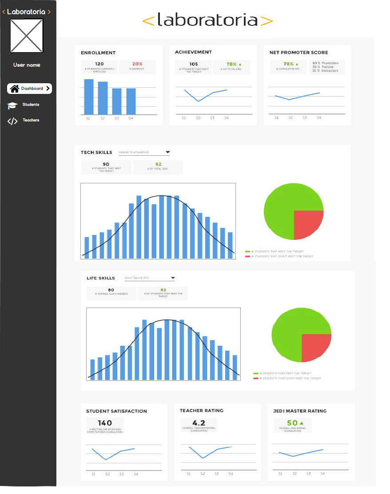
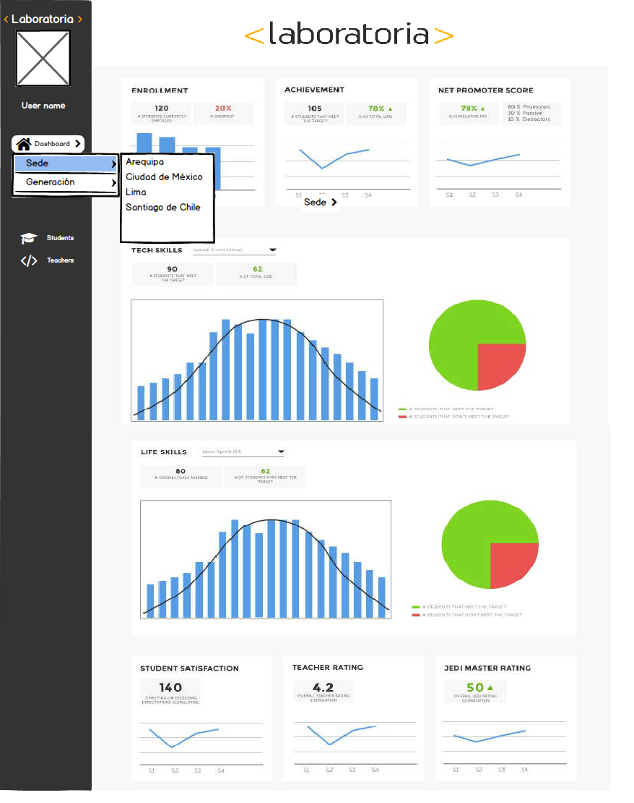

# **Data Dashboard**

Creación de la herramienta Datadashboard para los miembros y colaboradores de "Laboratoria".

De acuerdo a requerimientos de los usuarios despliega datos como:

1. Total de estudiantes presentes por sede y generación
2. Porcentaje de deserción de estudiantes.
3. Cantidad de estudiantes que superan la meta de puntos en promedio de todos los sprints cursados.
4. Meta de puntos es 70% del total de puntos en HSE y en tech.
5. Porcentaje que representa el dato anterior en relación al total de estudiantes.
6. Net Promoter Score (NPS).

